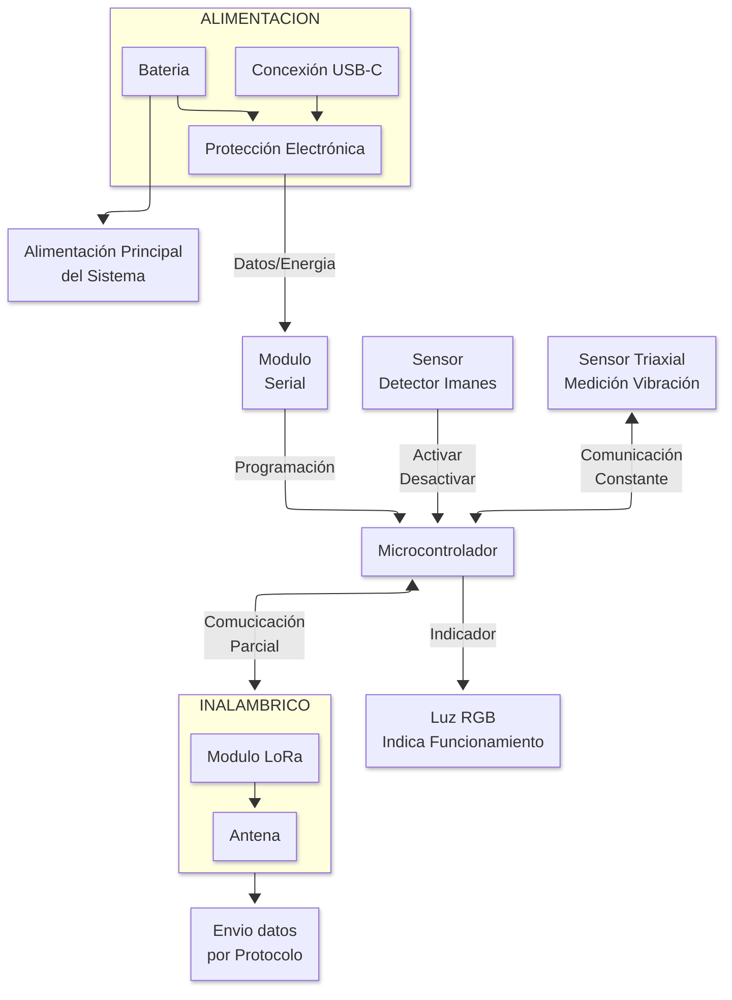
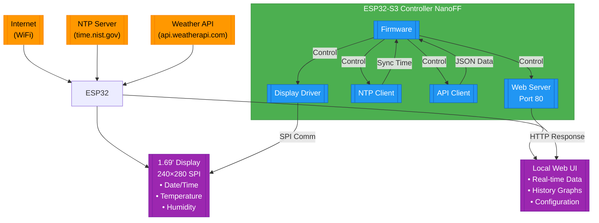

next

next
```mermaid
%% Diagrama de Conexiones ESP32-S3 Touch LCD 1.69"
graph TB
    %% ===== Núcleo Principal =====
    ESP32["ESP32-S3\n(NanoFramework)\n---\nWiFi/BT\nDual Core\n240MHz"] -->|SPI| LCD
    ESP32 -->|I2C| TOUCH
    ESP32 -->|I2C| RTC
    ESP32 -->|PWM| BUZZER
    ESP32 -->|RF| ANTENA

    %% ===== Periféricos =====
    LCD["Pantalla 1.69\nST7789V\n---\n240x280px\nSPI 4-wire"]
    
    TOUCH["Controlador Táctil\nFT6236\n---\nResolución: 1024x1024\nI2C@400kHz"]
    
    RTC["Reloj de Tiempo Real\nDS3231\n---\n±2ppm\nBatería CR2032"]
    
    BUZZER["Buzzer Pasivo\n---\nFrecuencia: 2-4kHz\nPWM 8-bit"]
    
    ANTENA["Antena PCB\n---\n2.4GHz\nGanancia: 2dBi"]

    %% ===== Estilos =====
    classDef mcu fill:#4CAF50,stroke:#2E7D32,color:white
    classDef display fill:#2196F3,stroke:#0D47A1,color:white
    classDef sensor fill:#FF9800,stroke:#E65100,color:black
    classDef comm fill:#9C27B0,stroke:#6A1B9A,color:white

    class ESP32 mcu
    class LCD,TOUCH display
    class RTC,BUZZER sensor
    class ANTENA comm
    ```