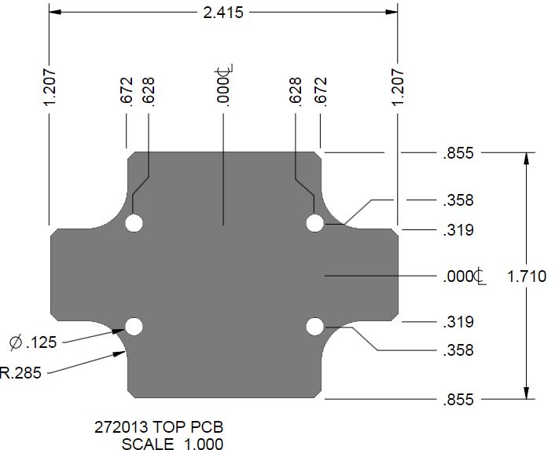
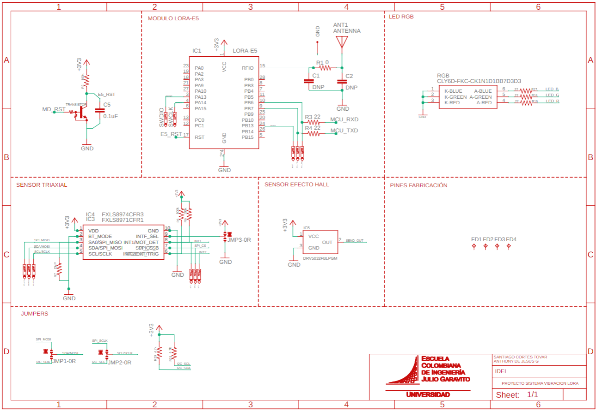
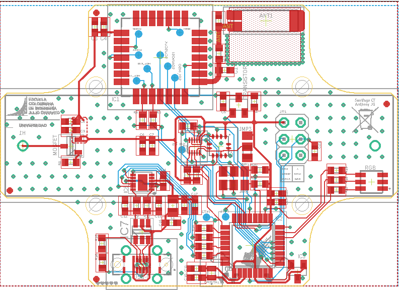

#### Diseño de un Sistema de Monitoreo de Vibraciones IoT con Conectividad LoRaWAN
# PROYECTO INTEGRACIÓN DISPOSITIVOS ELECTRÓNICOS

  
  
  
  
  

## Índice
* [PCB](#diseño-pcb)
* [3D](#diseño-3d)

## Entregables del Proyecto

### Entregable 1: Documentación Técnica y Conceptual
La guía se encuentra en el archivo _Markdown_ [Base entregable 1](./ent1.md) y abarca:
- **Introducción:** Presentación del proyecto, la motivación y los objetivos.
- **Detalle del Producto:** Especificaciones técnicas, características físicas y funcionales del dispositivo IoT.
- **Alcance de los Servicios Ofertados:** Descripción de los servicios incluidos, como el diseño de hardware, firmware, pruebas y documentación completa.
- **Exclusiones del Alcance:** Elementos y servicios que no se consideran en el proyecto (producción en masa, logística, etc.).
- **Valor:** Análisis de costos, desglose de inversión y metodologías de cálculo.
- **Cronograma de Trabajo:** Fases del proyecto y tiempo estimado para cada etapa.
- **Tiempo de Entrega:** Fechas clave y plazos para los entregables parciales y finales.

---

### Entregable 2: Diseño y Sustentación Técnica
Disponible en el archivo _Markdown_ [Base entregable 2](./ent2.md), este entregable se compone de:
- **Sustentación del Diseño:** Presentación y defensa del diseño, representando un 30% de la evaluación.
- **Informe Digital Detallado (35%):**
  - Descripción general de la solución y su justificación.
  - Diagramas de bloques que ilustren el flujo y la estructura de la solución.
  - Descripción detallada de cada bloque (funciones y relaciones).
  - Relación entre la solución y los requerimientos solicitados.
  - Especificaciones técnicas de los componentes electrónicos clave (MCU, memorias, fuentes, interfaces, etc.).
  - Diseño esquemático del sistema.
  - Diseño de PCB, presentando cada capa (máscara de componentes, anti-soldadura, crema, cobre y perforaciones).
  - Lista de materiales (BOM List).
  - Modelo 3D del producto final.
  - Cuadro de costos de producción para diferentes volúmenes (1, 10, 100, 500, 1000 y 5000 unidades).
- **Paquete Digital Adicional (35%):**
  - Informe en PDF con toda la documentación.
  - Archivo PDF del esquemático.
  - Archivos GERBER del diseño de la PCB.
  - Archivo BOM en Excel.
  - Archivo STEP o STL del modelo 3D.
  - Hoja de cálculo para el cuadro de costos, con fórmula automática según la cantidad a producir.
  - Hojas de datos (datasheets) de los componentes principales.

---

### Entregable 3: Manuales, Brochure y Prototipo Final
La guía se encuentra en [Base entregable 3](./ent3.md) y comprende:
- **Manual de Usuario:** Documento PDF que explica el funcionamiento y manejo del dispositivo (10%).
- **Brochure del Producto:** Ficha comercial en PDF que resalta las ventajas competitivas y características principales (10%).
- **Informe Digital Actualizado (20%):**
  - Descripción del firmware desarrollado y su funcionamiento.
  - Diagrama de flujo de la aplicación.
  - Detalle de los drivers implementados.
  - Retos y dificultades enfrentadas junto con las soluciones aplicadas.
  - Conclusiones finales y lecciones aprendidas.
  - Inclusión y actualización del paquete digital definido en el Entregable 2.
- **Prototipo Final Funcional:** Durante la presentación, se evaluarán todas las características y funcionalidades estipuladas en el proyecto (60%).

Cada uno de estos entregables está diseñado para garantizar una documentación integral y una validación exhaustiva del proyecto, cubriendo desde la concepción de la idea hasta la demostración práctica del sistema IoT.

# DISEÑO GENERAL
Antes de comenzar es necesario buscar sobre dispositivos similares y si existen, toda la idea de los componentes principales que tienen sus características principales en el diseño y después los requeridos para el funcionamiento de lo necesario.

## Diseño PCB

  

 Dimensiones 

Primer paso fue construir la PCB que entrara a la perfección dentro de la caja seleccionada que se ve a continuación.

Estas medidas se siguieron al pie de la letra para poder diseñar a la perfección la PCB y el circuito que se desea.

## Componentes
#### Componentes Usados

A continuación se describen los dispositivos fundamentales utilizados en el proyecto, documentados en los archivos PDF disponibles:

- **Socket Batería:** ([1015-socketbattery.pdf](./Documentos/1015-socketbattery.pdf))  
  Se especifica el diseño del conector para integración segura y confiable del paquete de alimentación.

- **Cristal Oscilador:** ([ABS06-cristal.pdf](./Documentos/ABS06-cristal.pdf))  
  Fundamental para la sincronización de circuitos, garantizando estabilidad y precisión en el reloj del sistema.

- **Bobina y Núcleo de Ferrita:** ([core_ferrita-coil.pdf](./Documentos/core_ferrita-coil.pdf))  
  Componentes críticos en la filtración y manejo de interferencias electromagnéticas en el circuito.

- **Convertidor Serial:** ([DS_FT234XD-serialconverter.pdf](./Documentos/DS_FT234XD-serialconverter.pdf))  
  Facilita la comunicación entre el microcontrolador y dispositivos externos mediante interfaces USB y serie.

- **Unidad de Medición Inercial (IMU):** ([FXLS8974CFR3-imu.pdf](./Documentos/FXLS8974CFR3-imu.pdf))  
  Incorpora sensores que permiten la detección y el análisis de movimientos y vibraciones, contribuyendo a la monitorización del estado del dispositivo.

- **Sensor de Efecto Hall:** ([hall_efect-sensor.pdf](./Documentos/hall_efect-sensor.pdf))  
  Utilizado para detectar cambios en campos magnéticos, lo que aporta datos relevantes en aplicaciones de control de propiedad magnética.

- **LED RGB:** ([HB_CLY6D-rgb_led.pdf](./Documentos/HB_CLY6D-rgb_led.pdf))  
  Proporciona indicadores visuales para el estado del sistema, útil para diagnósticos o notificaciones.

- **Módulo LoRa:** ([LoRa_E5_module.pdf](./Documentos/LoRa_E5_module.pdf))  
  Es el componente clave para la conexión IoT a través de la red LoRaWAN, permitiendo la transmisión de datos a larga distancia.

- **Transistor y MOSFET:** ([transistor.pdf](./Documentos/transistor.pdf), [SI2305B_SOT_23-mosfet.pdf](./Documentos/SI2305B_SOT_23-mosfet.pdf))  
  Empleados para la gestión de señales y el control de potencia dentro del circuito integrado.

- **Microcontrolador:** ([stm32l071v8-micro.pdf](./Documentos/stm32l071v8-micro.pdf))  
  El cerebro del sistema, encargado de coordinar las comunicaciones, procesar las señales de los sensores y gestionar las acciones del dispositivo.

- **Protección de Diodos:** ([usblc6_2SY6-diode-protection.pdf](./Documentos/usblc6_2SY6-diode-protection.pdf))  
  Asegura la integridad del circuito frente a sobretensiones y otros picos de corriente, protegiendo los componentes sensibles.

- **Antena:** ([W2311-antenna.pdf](./Documentos/W2311-antenna.pdf))
  La antena es un componente crítico en la conexión IoT a través de LoRaWAN. Su función es asegurar una comunicación fiable y de largo alcance al transmitir y recibir datos en frecuencias específicas.
  - **Tipo:** Diseñada para ser compacta y eficiente, comúnmente usando tecnología PCB o de hilo.
  - **Frecuencia Operativa:** Se adapta a bandas como 433 MHz, 868 MHz o 915 MHz, según las normativas locales.
  - **Ganancia y Eficiencia:** Optimizada para maximizar el alcance y garantizar una recepción estable.

## Esquemático
### Desarrollo del Esquemático

Para el desarrollo del esquemático se utilizó el software Eagle, lo que permitió integrar de forma precisa todos los elementos del circuito. Los componentes se seleccionaron desde Mouser y se incorporaron mediante el gestor de librerías Library Loader, asegurando una integración coherente y validada antes de avanzar al diseño de PCB.

  

  

## PCB
Ahora, con el diseño del esquemático como se planteo es construirlo en un modelo de caja

  

## Diseño 3D

  

