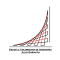
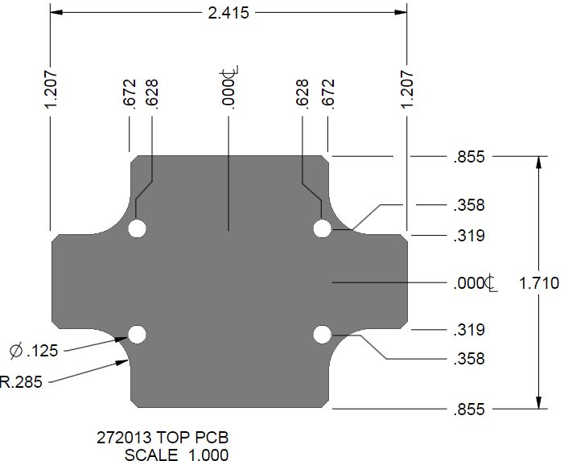
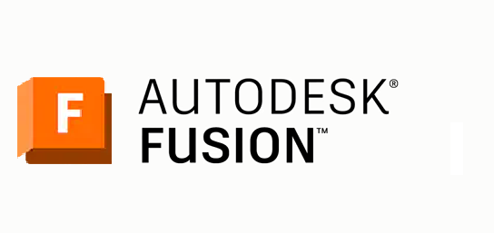

#### Diseño de un Sistema de Monitoreo de Vibraciones IoT con Conectividad LoRaWAN
# PROYECTO INTEGRACIÓN DISPOSITIVOS ELECTRÓNICOS

  
  
  
  
  

## Índice
* [PCB](#diseño-pcb)
* [3D](#diseño-3d)

## Entregable 1
Guía con el archivo _Markdown_ anexo en el repositorio. [Base entregable 1](./ent1.md)

>A. Introducción.
>B. Detalle del producto.
>C. Alcance de los servicios ofertados.
>D. Que no esta incluido en el alcance de los servicios ofertados.
>E. Valor.
>F. Cronograma de trabajo.
>G. Tiempo de entrega.

## Entregable 2
Guía con el archivo _Markdown_ anexo en el repositorio. [Base entregable 2](./ent2.md)

>A. Sustentación de su diseño en exposición con un valor del 30%.

>B. Informe digital con los siguientes requisitos (con un valor del 35%):
>>a. Descripción general de la solución.
>>b. Diagramas de bloques de la solución.
>>c. Descripción detallada de cada bloque de la solución.
>>d. Descripción de como la solución cumple con todos los requerimientos solicitados.
>>e. Datos Generales de los componentes electrónicos más característico (MCU, memorias, fuentes, interfaces, etc.), donde se describa la función que cumplen y los datos técnicos de operación.
>>f. Diseño esquemático.
>>g. Diseño de PCB, se debe presentar 1 hoja por cada capa del diseño; como mínimo mascara de componentes, mascara de anti-soldadura, mascara de crema, capas de cobre y perforaciones.
>>h. BOM List (Lista de materiales).
>>i. Modelo 3D del producto final.
>>j. Cuadro de costos de producción para cantidades de 1, 10, 100, 500, 1000 y 5000 unidades, incluyendo todos los costos para comercializar en Colombia.

>C. Paquete digital que contenga los siguientes elementos (con un valor del 35%).
>>a. Documento PDF del informe.
>>b. Archivo Esquemático del diseño en PDF.
>>c. Archivos GERBER del diseño de la PCB.
>>d. Archivo BOM en Excel.
>>e. Archivo STEP o STL del modelo en 3D del producto.
>>f. Archivo de cuadro de costos de producción en Excel formulado para calculo automático según la cantidad a producir.
>>g. Archivos de hojas de datos (datasheets) de componentes principales (MCU, memorias, fuentes, interfaces, etc.).

## Entregable 3
Guía con el archivo _Markdown_ anexo en el repositorio. [Base entregable 3](./ent3.md)

>A. Manual de usuario del dispositivo en PDF (con un valor del 10%).

>B. Brochure del producto desarrollado en PDF (con un valor del 10%).

>C. Informe digital del segundo entregable (punto 4.B) actualizado y con los siguientes requisitos adicionales (con un valor del 20%):
>>a. Descripción del firmware desarrollado.
>>b. Diagrama de flujo de la aplicación.
>>c. Descripción detallada de Drivers desarrollados.
>>d. Retos y dificultades que enfrentaron durante el desarrollo del proyecto, y como los solucionaron.
>>e. Conclusiones.
>>f. Paquete digital del segundo entregable actualizado (punto 4.C).
>>D. Prototipo final funcional, durante la presentación se verificarán todos las características y funcionalidades solicitadas en este documento (con un valor del 60%).

# DISEÑO GENERAL
Antes de comenzar es necesario buscar sobre dispositivos similares y si existen, toda la idea de los componentes principales que tienen sus características principales en el diseño y después los requeridos para el funcionamiento de lo necesario.

## Diseño PCB

  

 Dimensiones 

Primer paso fue construir la PCB que entrara a la perfección dentro de la caja seleccionada que se ve a continuación.

Estas medidas se siguieron al pie de la letra para poder diseñar a la perfección la PCB y el circuito que se desea.

 Esquemático 

 Pronto

 PCB 

 Pronto

 Extra 

 Pornto

Materiales:
* Modulo LoRa [LoRa-E5](https://co.mouser.com/ProductDetail/Seeed-Studio/317990687?qs=hd1VzrDQEGhZOj13wvzSLA%3D%3D)  
* Microcontrolador [STM32L071KBT6](https://co.mouser.com/ProductDetail/STMicroelectronics/STM32L071KBT6?qs=mKNKSX85ZJf5FR8Umx1PEQ%3D%3D)
* Modulo IMU [FXLS8971CFR1](https://co.mouser.com/ProductDetail/NXP-Semiconductors/FXLS8971CFR1?qs=2wMNvWM5ZX4%252B65U5I7Iudw%3D%3D) [FXLS8974CFR3](https://co.mouser.com/ProductDetail/NXP-Semiconductors/FXLS8974CFR3?qs=QNEnbhJQKva4g7R74%252BwIOg%3D%3D)
* Antena [w3211](https://co.mouser.com/ProductDetail/Pulse-Electronics/W3211?qs=l7cgNqFNU1g5WBF3n%252BWoMg%3D%3D)
* Sockbateria 

## Diseño 3D

  

